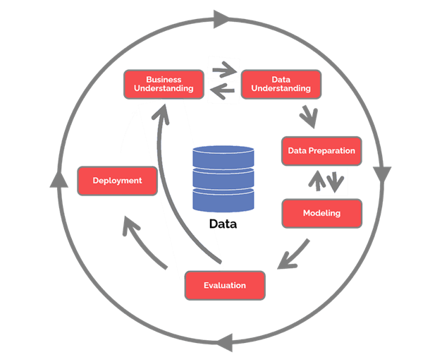

```{r setup, include=FALSE}
knitr::opts_chunk$set(echo = TRUE)
```

**ABSTRACT**

**The scope of this paper has been to investigate wether a donor, who donates more than once to Donors.Choose.org, who is an american crowfunding platform that supports pupils in public schools, has specific characteristics, and destill a statistical model with this outcome.**

**Donors.Choose.org if being a danish nonprofit organisation, it would have been under the European and Danish law of data and data-ethics. The legislation covering this area are," e-PR", "EU´s Cookiedirektiv" and "Persondataloven". The controlling authorities are in DK "Datatilsynet" and "Erhvervsstyrelsen", and the etic aspects of these issues are taken care of by a nonpolitical organ called "Etisk Råd".**

**This paper is built on the datamining model CRISP, which controls the working faces of the statistical ML work in progress. In this case various Machine Learning methods have been used on the data.**

**The result of the statistical tests performed on the chosen data reveals unfortunately that the data not are sufficient to make an approvable model for the group of donors who donates more than once, but only gives a hunch, that teachers as donors are in this group.**

**An alternative model might be able to explain the donor problematics better, as some trials with geografical data shows. This thou demands further investigation and testing.**

# DonorsChoose introduktion

DonorsChoose.org er en non-profit-organisation, der blev startet i 2000 af en lærer ved navn Charles Best. Han arbejdede som underviser på en offentlig skole i Bronx, New York, og han ønskede, at hans elever skulle læse "Det lille hus på prærien". Han tænkte på alle de penge han selv og hans kolleger brugte på bøger og andre materialer, og tænkte, at der sikkert var nogen der ude et sted, som var interesserede i at hjælpe, hvis de kunne se hvad deres penge gik til. Derfor lavede Charles Best et website hvor lærere kunne poste deres ønsker og hvor donorer kunne vælge de projekter de ønskede at støtte. Hans kolleger postede de første 11 anmodninger, og siden spredte det sig og i dag er hjemmesiden åben for alle offentlige skoler i hele USA.

(kilde: [About us \| DonorsChoose](https://www.donorschoose.org/about) -- frit oversat fra engelsk)

## Forretningsproblematik

De fleste donorer giver kun 1 gang til DonorsChoose.org, også selvom hjemmesiden tilbyder donorerne at lave en abbonnementsordning, og selvom der sorteres i de projekter der ansøges penge til. DonorsChoose.org er derfor interesseret i at finde frem til det der karateriserer de donorer, der giver mere end 1 gang, for på den måde bedre at kunne målrette markedsføringen mod disse.

## Statistisk problemformulering

Formålet med denne undersøgelse er at finde frem til eventuelle karakteristika hos flergangsdonorer og opstille en model for hvordan disse påvirker om en donor giver 1 eller flere gange.

Den hypotese, der kan opstilles, er et klassifikationsproblem, og ser ud som følger:

Y= 0 = donoren har kun givet 1 gang

Y= 1 = donoren har givet mindst 2 gange

Som udgangspunkt har jeg valgt at fokusere på om donortypen afhænger af hvem, der har oprettet projektet, klassetrin og projekttype, samt om donoren selv er lærer.

Jeg har valgt at opstille to konkurrerende modeller, som jeg har testet med flere forskellige statistiske metoder i Rstudio.

De to modeller, jeg har opstillet, kalder jeg Model 1 og Model 2, og de udtrykkes:

Model 1: y \~ projekttype + klassetrin + projektkategori + e (hvor e er fejlleddet)

Model 2: y \~ Er donor lærer? + projekttype + klassetrin + projektkategori + e (hvor e er fejlleddet)

Det er y=1 jeg er interesseret i, og jeg ønsker derfor at afvise 0-hypotesen med min statistiske model. Som udgangspunkt har jeg sat konfidensintervallet til 95%, og derfor skal en model med minimum 95% sikkerhed kunne forudsige om en donor vil tilhøre y=1, nemlig flergangsdonorne.

# Metode

Den overordnede metode, der er anvendt i denne opgavebesvarelse er "CRISP"- modellen.

Nedenstående viser en skematisk figur over princippet.

{width="422"}

Figur 1: CRISP-DM-diagram. Inspireret af Wikimedia

([\<https://www.datascience-pm.com/crisp-dm-2/\>](https://www.datascience-pm.com/crisp-dm-2/){.uri})

# De 6 CRISP-faser set i forhold til DonorsChoose-problematikken

Forretningsforståelse Ethvert godt projekt starter med en dyb forståelse af kundens behov. Data mining-projekter er ingen undtagelse, og CRISP-DM anerkender dette. Forretningsforståelsesfasen fokuserer på at forstå de mål og krav til projektet.

### Fase 1: Forretningsproblematikken

Donorschoose ønsker at målrette sin indsats mod de donorer, som giver mere end 1 gang.

Man har allerede lavet et interface, som giver donorerne mulighed for at vælge et månedsabbonnement med et fast beløb. Og der er frit valg mellem de opstillede projekter hver måned.

Donorschoose kunne således starte med at se på hvilke donorer, der vælger et abbonnement, fremfor en enkeltdonation. Men eftersom der er tale om crowd-funding, og antallet af donorer kan være meget stort, og hvert bidrag lille, så kan det være svært ud fra de nuværende data at finde karakteristika uden, at se på personoplysninger, da mange af donorerne er privatpersoner.

Dersom DonorsChoose ud fra de hér givne data kunne finde en sammenhæng mellem de typer projekter der søges penge til (ansøger-siden) og de donorer, der giver mere end 1 gang (donor-siden), så kunne DonorChoose bedre målrette sine ansøgninger.

Derfor vil jeg i det følgende fokusere på at se på sammenhængen mellem projektype og donorer, der har givet mere end 1 gang.

Data til rådighed

Jeg har 6 dataset til rådighed, men har ikke brug for dem alle i min undersøgelse. En del af variablene går igen i flere af datasættene. Og alle data er anonymiseret, dvs at det ikke er muligt at føre donorsiden længere tilbage end til et geografisk område. Projektsiden er kategoriseret, så det er muligt at sortere på disse data.

Data mining problem

Vi ønsker at isolere de donorer, der giver mere end 1 gang. Dette gør vi ved at opdele donorerne i to typer: type 0, som giver kun 1 gang og type 1, som giver flere gange.
Vi vil forsøge at finde en prædiktionsmodel til forudsigelse af hvilken donortype denne tilhører.

De to hypoteser der kan opstilles er:

H0: Der er ingen sammenhæng mellem de uafhængige og den afhængige variabel.
H1: Der er sammenhæng mellem de uafhængige og den afhængige variabel.

Det valgte signifikansniveau er 5% og dette betyder, at sandsynligheden for at begå en type 1 fejl, nemlig at forkaste hypotesen, selvom den er sand er 5%. P-værdien for hver variabel afgør om denne er signifikant eller ej. Dette ses bl.a. i den logistiske regression.

Jeg har valgt at fokusere på at lede efter sammenhænge mellem fler-gangsdonorer og projekttyper. De tre faktorer, som jeg fokuserer på i denne undersøgelse er: projekttype, dvs hvem der står bag ansøgningen om donorstøtte, og hvilket klassetrin der søges støtte til, samt hvilken katagori af midler, der søges penge til.

Der opstilles 2 alternative modeller som testes for at finde ud af hvor god den enkelte model er til at beskrive sammenhængen mellem de uafhængige og den afhængige variabel, med andre ord sammenhængen mellem de førnævnte faktorer og donortypen, som har to udfald, nemlig, engangsdonor og flergangsdonorer (y=0, y=1)


(kilde: https://www.biostat.au.dk/teaching/praegrad/for%C3%A5r2001/forelaesninger/biostatistik/uge2torsdag.pdf)

### Fase 2: Dataforståelse

Dernæst er dataforståelsesfasen . Tilføjelse til grundlaget for forretningsforståelse driver det fokus til at identificere, indsamle og analysere datasættene, der kan hjælpe dig med at nå projektmålene. Denne fase har også fire opgaver:

Indsamling af data

Jeg har fået tildelt 6 datasæt som indledningsvis er blevet først uploadet til et SQL-database og herefter downloadet til rstudio-arbejdsrummet, hvor resten af databearbejdningen foregår som R-programmering.

Databeskrivelse

Alle data er lagret som csv-filer, hvilket er det samme som xls, og de er derfor meget nemme at uploade til arbejdsinterfacet i rstudio. De datasæt jeg har valgt at arbejde videre med er: donation.rds og Donors.csv.zip. Jeg kunne godt nøjes med at kun anvende donation.rds, men jeg vil gerne vise, at jeg kan sætte flere datasæt sammen. Ulempen ved dette er dog, at det formindsker datasættet. Imidlertid er det hele populationen jeg har til rådighed, så jeg er ikke bekymret for at mangle observationer.

Udforskning af dataene

De to datasæt jeg har udvalgt har manglende værdier i hovedsageligt de numeriske og geografiske data, mens de kategorier jeg har valgt at fokusere på ser pæne ud. De manglende værdier er det eneste problem .

### Fase :3 Dataforberedelse

Jeg har valgt at slette de rækker, der indholder manglende værdier, fordi der kun var ganske få i de datakolonner jeg skal bruge, set i forhold til hele datasættet.

### Fase 4: Modellering

Der er tale om et klassifikationsproblem med 2 udfald, og derfor har jeg valgt at sammenligne resultaterne af 3 forskellige metoder, logistisk regresson, lineær diskriminant analyse og kvadratisk diskriminantanalalyse.

Valg af modelleringsteknikker

Til at løse denne opgave har jeg først og fremmest valgt at bruge logistisk regression, LDA (lineær diskriminant analyse) og QDA ( kvadratisk diskriminantanalyse), fordi der er tale om et klassifikationsproblem, idet den afhængige variabel y er en to-delt faktor.

Jeg har desuden brugt et klassifikations-træ til at udforske mulige forskellige konstellationer af modeller og jeg har afprøvet mange forskellige modeller, som ikke er gengivet i denne opgave.

Opdeling i trænings- og testsæt

Til at finde frem til en forudsigelsesmodel har jeg opdelt datasættet i et trænings- og et testsæt i forholdet 80%/20%, og jeg har opstillet følgende model: y = projekttype + klassetrin + projektkategori + e,
hvor y er en 0/1 variabel, der forklarer hvorvidt en donor har givet 1 gang (0) eller flere gange (1).

Jeg har i datasættet medtaget hvorvidt donoren er lærer eller ej, selvom andelen af denne gruppe kun er 10 %. Dette har jeg gjort, fordi jeg sidst i opgaven forsøger at lave et klassifikationstræ, og uden denne variabel giver træet ikke mening.

### Fase 5: Evaluering af den statistiske modellering

De to udvalgte datasæt har jeg fusioneret og arbejdet videre med for at finde den bedste model af to alternativer. Resultatet har desværre været dårligt set i et statistisk perspektiv, da selv den bedste model ikke forklarer meget bedre end ingen model.

### Fase 6: Implementering

I denne opgave erstattes oplæg til forretningsudvalget i DonorsChoose.org med en vurdering af alterantive løsningsmodeller.

## Arbejdsprocessen

Som beskrevet i CRISP har jeg undervejs afprøvet flere forskellige modeller ud fra de valgte data. Jeg har forsøgt med modeller, hvor både donor-stat (USA) og donor-postnummer er medtaget. Det har givet meget store decision-trees, men modellerne har været præget af overfitting p.g.a. de mange variabel-levels. Og de to modeller jeg har arbejdet videre med, har jeg reduceret antallet af levels i.

Det har været mit ønske at finde en sammenhæng mellem de forskellige kategori-variable og hvorvidt en donor giver mere end 1 gang, men min Model 1, som kun indeholder disse variable, viser ingen eller kun lav sammenhæng, ikke nok til at modellen er brugbar. I Model 2 har jeg tilføjet variablen, der fortæller om donor er lærer eller ej, og denne variabel giver den bedste forklaring af om en donor giver mere end 1 gang, idet der er en tydelig sammenhæng mellem at en donor giver flere gange og at samme er lærer.


## Opgavens Juradel

DonorsChoose er en amerikansk nonprofit organisation der fungerer som bindeled mellem offentlige skoler, der søger penge, og potentielle donorer af samme.
I det følgende vil jeg diskutere de etiske og juridiske aspekter omkring det scenarie, at DonorsChoose.org var hjemmehørende i Danmark.
Først ser jeg på de jurisdiske aspekter hvis DonorsChoose var dansk, og de lovkrav der ville være gældende i Danmark for en nonprofit organisation som DonorsChoose. Dernæst ser jeg på DonorsChoose i et dataetisk perspektiv, og diskuterer de samfundmæssige og politiske aspekter i forbindelse hermed.

### Juridiske aspekter omkring DonorsChoose i Danmark

Der er flere love, der kommer i spil, dersom DonorsChoose var hjemmehørende i Danmark: Købeloven, Markedsføringsloven, Forbrugeraftaleloven, Indsamlingsloven, Persondataloven, GDPR og Cookie-direktivet.
I Danmark gælder Indsamlingsloven (LOV nr 511 af 26/05/2014) for indsamling til velgørende formål, og DonorsChoose.org indsamler til velgørende formål. §1 fastslår: “§ 1. Denne lov finder anvendelse på indsamlinger, hvorved forstås enhver form for opfordring til at yde bidrag til et forud angivet formål.” Loven gælder dog ikke for indsamlinger foretaget blandt juridiske personer. Men DonorsChoose.org indsamler blandt fysiske personer og derfor finder Indsamlingsloven anvendelse . En juridisk person definers nemlig som: “En juridisk person er en organisation, som har selvstændig retsevne, som f.eks. et selskab, en fond eller en forening.” Fysiske personer af kød og blod anses ikke for juridiske personer.
(kilde: eLOV.DK - Juridisk person)

DonorsChoose.org indsamler gennem en hjemmeside. For hjemmesider gælder at de ikke må være vildledende i sin fremtoning, og der skal klart gøres opmærksom på, at der anvendes cookies, samt at brugeren skal kunne vælge alle andre cookies end de teknisk nødvendige fra.
Dernæst må DonorsChoose kun opbevare persondata, der er nødvendige for at donationsformidlingen kan ske. Og de må kun opbevares i den tid der er brug for dataene.
En organisation som DonorsChoose ville i Danmark blive kontrolleret af finanstilsynet, selvom de er en non-profit organisation, og af datatilsynet, fordi der opbevares data.
DonorsChoose er både dataansvarlig og databehandler. Som dataansvarlig har organisationen pligt til at opbevare persondata, både for eventuelle ansatte, ansøgere og donorer, på en forsvarlig måde, med respekt for den enkelte persons privatliv.

Ifølge Persondatalovens kap. 2, § 3, definerer personoplysninger som “enhver form for information om en identificeret eller identificerbar fysisk person (den registrerede)”. DonorsChoose registrerer og opbevarer oplysninger om donorerne; navn, adresse og bankoplysninger, for at kunne gøre det de gør.
Selv om DonorsChoose er en nonprofit organisation kan man sige, at der sker en udveksling af goder, og service, og derfor gælder forbrugeraftaleloven og købeloven. En donor, være det sig en fysisk person, eller en organisation, er på denne måde juridisk sikret at pengene går til det ønskede projekt.
I henhold til dansk lovgivning er DonorsChoose også forpligtet til at indhente samtykke fra hver enkelt donor om indgåelse af en aftale, d.v.s. at donor skal aktivt godkende indgåelsen af en aftale om donation. Det samme gælder i øvrigt tilsagn om anvendelse af cookies og opbevaring af persondata.
Samtykke kræver en aktiv handling fra brugeren I dommen blev det fastslået, at et forudafkrydset felt ikke kan udgøre et gyldigt samtykke, fordi brug af cookies på internetsider kræver en aktiv handling hos brugeren. I dommen kan man læse, at kravet om brugerens aktive handling udspringer af en fortolkning af begrebet samtykke, der defineres som en ”frivillig, specifik og informeret viljestilkendegivelse” – og at behandling af personoplysninger kun må finde sted, hvis ”der ikke hersker tvivl om, at den registrerede har afgivet sit samtykke” (Direktiv 95/46/EF, artikel 2, litra f) og artikel 7, litra a). Jvf.: EU-Domstolen har den 1. oktober 2019 afsagt en præjudiciel dom om krav til samtykke ved brugen af cookies (Sag C-673/17). Jvf.: Persondataloven kap. 2, §3 stk 8 om registreret samtykke.

§6 I Persondataloven beskriver videre hvordan behandling af personoplysninger må finde sted, når der er givet samtykke hertil. Der må ikke behandles oplysninger om racemæssig eller etnisk baggrund, politisk, religiøs eller filosofisk overbevisning, fagforeningsmæssige tilhørsforhold og oplysninger om helbredsmæssige og seksuelle forhold. (kilde: Retsinformation.dk)
(kilde: Cookiebekendtgørelsen)

Til beskyttelse af persondata, herunder bankoplysninger, gælder GDPR, Cookie-bekendtgørelsen, Databeskyttelsesloven og Persondataloven. I USA lægger lærere og klasser billeder op af sig selv når de søger penge til projekter, og med de skærpede regler for udbredelse af fotos af fysiske personer ville dette i Danmark kræve samtykke fra alle på billedet, og hvis det er børn, så er det børnenes forældre, der skal give samtykke. Jvf. Cookiebekendtgørelsen §3.
Både ansatte, ansøgere og donorers data er beskyttet af den danske og europæiske lovgivning.
Og hvis DonorsChoose videregiver ikke anonymiserede person- eller virksomhedsdata til trediepart, som i tilfældet med Kaggle, eller hvis de bruger tredjeparts del-interfaces, så skal der indhentes tilsagn fra brugeren. I det konkrete tilfælde med Kaggle er dataene anonymiseret, så der indgår ingen oplysninger der peger direkte på bestemte fysiske personer eller organisationer.

### Cookies

De danske cookieregler fremgår af cookiebekendtgørelsen, “Bekendtgørelse om krav til information og samtykke ved lagring af eller adgang til oplysninger i slutbrugeres terminaludstyr”. Cookiebekendtgørelsen implementerer e-databeskyttelsesdirektivet fra 2002 med seneste ændringer fra 2009 (direktiv 2019/136/EF), hvormed samtykkekravet blev indført.
De allerfleste hjemmesider bruger “cookies”, som er en datafil, der opbevarer oplysninger om brugerne af hjemmesiden.
Cookies opdeles i 4 typer: Tekniske cookies, Statistik cookies, Markedsførings cookies og Tracking cookies (også kaldet “personaliserede cookies”).
Tekniske cookies, som er nødvendige for at hjemmesiden kan fungere interaktivt med brugeren kræver ikke tilladelse fra brugeren, men det gør de 3 andre typer.
I EU er reglerne blevet strammet, og det er hjemmeside-ejerens pligt at overholde, at brugeren af hjemmesiden kan vælge hvilke cookies denne vil give tilsagn til. Ligesom samme har ansvar for at der er gennemsigtighed i interfacet.
Erhvervsstyrelsen fører tilsyn med at reglerne bliver overholdt og har udarbejdet en vejledning til bekendtgørelsen, der bl.a. indeholder eksempler på, hvordan cookiereglerne kan overholdes. 
(kilde: Lovgivning og vejledning om cookiereglerne | erhvervsstyrelsen.dk, 8. Marts 2021)

### Etiske aspekter omkring nonprofit crowdfunding i Danmark

Finanstilsynet definerer crowdfunding således: “Crowdfunding som begreb Begrebet dækker i nærværende over aktiviteter uden den fornødne finansie ring, hvor initiativtagerne henvender sig til et større eller mindre antal perso ner med det formål at opnå finansieringen fra dem. Henvendelsen sker ty pisk via internettet, og det er sjældent, at de involverede personer kender hinanden på forhånd. De involverede beløb for både den samlede aktivitet og de enkelte bidrag er sædvanligvis små.” 
(kilde: Finanstilsynet, NotatCrowdfunding, 18. Nov. 2013)
“De forskellige former for crowdfunding er i vækst i Danmark, og stadig flere platforme på nettet tilbyder crowdfunding. Alligevel er Danmark fortsat bagud i forhold til mange andre lande, som vi normalt sammenligner os med. Derfor kommer DI nu med en række anbefalinger, som skal øge udbredelsen og kendskabet til crowdfunding i Danmark.”
(kilde: DI: Vi skal booste crowdfunding i Danmark › Branche, teknologi, komponentdistribution | Elek-Data.dk)

DonorsChoose.org er en non-profit organisation med velgørenhed som formål. Og Danmark er meget forskelligt fra USA når det kommer til synet på velgørenhed. Vi har et velfærdssamfund og anser det for en selvfølgelighed, at de offentlige skoler gennem skattebetalingen får tildelt tilstrækkelige ressourcer til, at det ikke er nødvendigt at søge midler fra private gennem f.eks. crowdfunding. Og selvom crowdfunding er i vækst i Danmark indenfor den private sektor, så har det indtil videre været skik, at visse dele af samfundet har været skattefinansieret, herunder sygehusvæsen, politi og undervisningssektoren.

Man kunne forestille sig, at crowdfunding til offentlige skoler, ligesom DonorsChoose, politisk ville blive anset for en “glidebane” mod et “dårligere velfærdssamfund”. Og selvom danske private skoler har benyttet sig af crowdfunding, er der bred politisk støtte til at undgå, at det bliver reglen i stedet for undtagelsen, at der skal søges ekstra finansiering af hvad der tilhører den offentlige sektor.
I USA er situationen forskellig fra stat til stat, f.eks. betaler man hverken indkomst- eller ejendomsskat i visse stater, hvilket betyder, at skolerne skal privatfinansieres gennem velgørenhed, eller drives som private foretag. Hvor vi i Danmark ville se det som en “falliterklæring” for velfærdssamfundet, hvis en offentlig skole manglede midler, eller dersom eleverne var så dårligt socialt stillet, at skolen måtte ty til at søge penge til basale fornødenheder, så er crowdfunding og velgørenhedsindsamlinger normalen i USA.
I Danmark ser vi det ikke som lærerens ansvar at sørge for at der er bøger eller laptops til rådighed for eleverne, eller at sørge for at eleverne for nok at spise og holder et fornuftigt hygiejne-niveau. Men i de økonomisk belastede områder i USA koncentreret om de største byer, som New York og Los Angeles er det udbredt, at supplere med private midler. Staterne Florida og Texas er også steder hvor velgørenhedsindsamlinger er udbredt, fordi skattesystemet er minimalt. I Texas betales der hverken indkomst eller ejendomsskat.

### Dataetiske lovkrav i Danmark

Det fremgår af kommissoriet for Dataetisk Råd, at: 
“Dataetik forstås overordnet som den etiske dimension af forholdet mellem på den ene side teknologi og på den anden side borgernes grundlæggende rettigheder, retssikkerhed og grundlæggende samfundsmæssige værdier, som den teknologiske udvikling giver anledning til at overveje. Begrebet omfatter etiske problemstillinger ved anvendelsen af data”.
I Danmark har statslige aktieselskaber, børsnoterede virksomheder samt virksomheder med, to år i træk, en balancesum på over 156 millioner, en nettoomsætning på over 313 millioner og et gennemsnitligt antal ansatte på 250, ifølge Regnskabsloven pligt til i forbindelse med årsregnskabet at beskrive virksomhedens dataetiske målsætninger.
(kilde: Vejledning om lovpligtig redegørelse for dataetik | erhvervsstyrelsen.dk)
DonorsChoose hører ikke til nogen af disse typer virksomheder og er derfor fritaget fra at udgive sine dataetiske målsætninger med årsregnskabet.

### Dataetisk Råd

Dataetisk Råd blev stiftet i 2019 og har 13 medlemmer (inklusive formanden). Rådet har til opgave at understøtte en ansvarlig og bæredygtig dataanvendelse i erhvervslivet og i den offentlige sektor. Konkret skal Dataetisk Råd bidrage til en åben debat om brugen af nye digitale løsninger, data, kunstig intelligens osv. og de dilemmaer, som de nye teknologiske muligheder rejser. (kilde: Dataetisk Råd (digst.dk))
Rådet er ikke kontrollerende, men skal vejlede politiske myndigheder og Folketinget i relevante spørgsmål i forhold til samfundsudviklingen, og har derfor en relevant rolle overfor de lovdannende instanser på dataområdet.


## Beskrivelse af datasættene, variable og variabelniveauer (levels)

Der er i alt blevet stillet seks datasæt til rådighed for undersøgelsen, "donation", "donors", "project", "resources", "schools" og "teachers". Alle datasæt stammer oprindelig fra internetplatformen Kaggle, som tidligere har haft udskrevet en konkurrence på baggrund af dem. Indholdet i datasættene overlapper indbyrdes og indeholder id-nøgler til sammenlægning. I det følgende giver jeg en beskrivelse af hvert enkelt datasæt og dets indhold som baggrund for at udvælge de datasæt jeg vil arbejde videre med. Donation Dette datasæt har 18 variable, der beskriver de donationer der er færdigbehandlede og hvilke projekter der er givet midler til, om projektet er blevet fuldt støttet og om der blev givet frivillig ekstra donation, og hvilken status projektet havde på dataindsamlingstidspunktet, samt alle id-nøgler, "Project ID", "Donation ID", "Donor ID", "Teacher ID" og "School ID". Fordelen ved dette datasæt er, at det indeholder mange af variablene fra de andre datasæt, og det kunne på baggrund af dette, alene danne grundlag for en statistisk undersøgelse. Donors Donors-datasættet, som har 4 variable, indeholder en id-kode for hver donor, samt geografiske data om donorens hjemby, herunder postnummer og hvilken stat i USA, donoren bor i. Derudover indgår en variabel, der fortæller om donoren er lærer eller ej. Mange lærere giver selv donationer, fordi der ikke er midler i skole- eller forældre regi til at betale for de fornødne materialer, der er nødvendige for at undervisningen kan blive fyldestgørende for eleverne. Hvis variablene behandles som faktorer, giver det mange underniveauer (levels) og kan være vanskeligt at lave statistiske analyser på. F.eks. så indgår der mere end 8000 postnumre og alle 50 stater. Men man eventuelt lægge niveauerne sammen efter udvalgte retningslinier. Man vil ud fra dette datasæt kunne lave en geografisk fordeling af antallet af donorer. Project Hvor Donors er sponsorsiden, så er dækker dette datasæt ansøgersiden af de projekter der er blevet postet på DonorsChoose.org. Datasættet, som har 14 variable, indeholder ud over "Project ID", "School ID" og "Teacher ID" beskrivelse af hvert enkelt projekts indhold opdelt på underkategorier, samt om projektet er fuldt finansieret og hvilken status det havde på dataindsamlingsøjeblikket, og hvilken dato projektet er postet og finansieret. Nogle af variablene indeholder mange underniveauer (levels). Disse underniveauer beskriver indholdet af projekterne, herunder hvilke kategorier, der er givet til, f.eks. om der er givet til ekskursioner, hygiejne eller teknologi. Ud fra dette datasæt kan man bl.a. finde frem til fordelingen af donationer på hver projektkategori. Resources Dette datasæt med 5 variable minder om "project" i indhold, og beskriver udover "Project ID" specifikt hvad der er givet penge til, f.eks. "laptops -- 20 stk af mærket Lenovo" og hvad hver enhed har kostet, samt hvor enhederne er købt. Ud fra dette datasæt vil man kunne se om der er bestemte leverandører der favoriseres.

Schools Dette datasæt med 9 variable fortæller noget om den enkelte skole, som har søgt om donation, udover "School ID", skolens navn og geografiske tilhørsforhold, samt om eleverne får frokost på skolen og om der skal betales for at gå på skolen. Også i dette datasæt er der, på grund af de geografiske oplysninger, mange underniveauer (levels) til variablene. For en statistisk undersøgelse, der omhandler økonomiske forhold fordelt på geografi, kan dette datasæt være interessant. Teachers Teachers datasættet består af 3 variable, hvoraf den ene er "Teacher ID" og de to andre er hvorvidt læreren er "Mr", "Ms" eller "Mrs" og hvornår denne postede sin første projektansøgning. Det interessante i dette datasæt kunne være at se om der er forskel mellem mandlige og kvindelige lærere i deres donationsadfærd.

```{r}
pacman::p_load("tidyverse", "magrittr", "nycflights13", "gapminder",
"Lahman", "maps", "lubridate", "pryr", "hms", "hexbin",
"feather", "htmlwidgets", "broom", "pander", "modelr",
"XML", "httr", "jsonlite", "lubridate", "microbenchmark",
"splines", "ISLR", "MASS", "testthat", "caret", "gbm",
"RSQLite", "class", "babynames", "nasaweather", "pls",
"fueleconomy", "viridis", "boot", "devtools", "tree",
"glmnet", "gam", "akima", "factoextra", "randomForest",
"ggrepel", "GGally", "fmsb", "sjPlot", "rcompanion",
"leaps", "caretEnsemble", "dplyr")
```

## Udvalgte datasæt

De datasæt jeg har valgt at arbejde med er, Donors og donation, hvor Donors indeholder beskrivelse af donorerne, deres geografiske tilhørsforhold og de projekter de har givet til. Donation-datasættet indeholder oplysninger om hvilke typer projekter, der er givet penge til, hvilken type styring det enkelte projekt har været underlagt, samt hvilket klassetrin donationen er givet til.

```{r}
donation <- readRDS("donation.rds")
Donors <- read_csv("Donors.csv.zip")
```

## Undersøgelse og tilpasning af datagrundlaget

Datagrundlaget undersøges for problemer og manglende værdier, samt wrangles som optakt til den forestående statistiske modellering.

### Variabel-niveauer (levels)

De fleste af variablene i datasættene er faktorer med mange underniveauer (levels). Dette gør det vanskeligt at bearbejde dataene direkte, og løsningen er at lægge niveauerne sammen. Derved forbedres dataenes evne til at indgå i de ML teknikker, der vælges at arbejde med. F.eks. er det ikke muligt at lave Random Forest analyse på variabler med mere end 32 niveauer.

Fusionering af datasæt Efter at have importeret datasættene fusioneres disse således at der fremkommer et datasæt at arbejde videre med. Der fusioneres med "donor-id" som nøgle og resultatet er 1 sammenhængende datasæt, der kan arbejdes videre med, når blot dette er renset for problemer og manglende værdier.

```{r}


donor_data <- Donors %>% inner_join(donation) %>%
  dplyr::select("Donor ID", "Donor Is Teacher","Project Type","Project Grade Level Category","Project Resource Category", "doation_date") %>%
  dplyr::rename(
    don_id="Donor ID",
    don_teach="Donor Is Teacher",
    pro_type="Project Type",
    pro_grade="Project Grade Level Category",
    pro_rcat="Project Resource Category",
    don_date=doation_date,) %>%
  group_by(don_id) %>%
  mutate(y=if_else(n()>1,1,0)) %>%
  arrange(don_id, don_date) %>%
  slice(1)
 
    
```

SAMPLE

```{r}
set.seed(23)
donors <- donor_data[sample(nrow(donor_data), 10000), ]
```

```{r}
donor_df <- donors[,c(-1,-6)] 
```

UDVÆLGER DE VARIABLE JEG SKAL ARBEJDE MED

```{r}
donors_m <- donor_df %>%
  dplyr::select(don_teach, pro_type, pro_grade, pro_rcat, y)
```

### Rensning af data

Det har vist sig, at de fusionerede data ikke indeholder nogen problemer udover manglende værdier, og disse er der ikke mange af. Faktisk så få, at jeg har valgt at slette disse, fordi jeg har vurderet at det set i forhold til stikprøvestørrelsen ikke ville betyde noget for resultatet af testene.

PROBLEMS

```{r}
problems(donors_m)
```

NAs

```{r}
#is.na(donors_m) 
```

```{r}
colSums(is.na(donors_m)) 
```

SLETTER NAs

```{r}
donors_clean <- na.omit(donors_m) 
```

VARIABELTYPER TILPASSES

```{r}
donors_f <- mutate_at(donors_clean, vars(don_teach, pro_type, pro_grade, pro_rcat, y), as.factor)
```

CHECK LEVELS PÅ FAKTORER

```{r}
levels(donors_f$don_teach)
```


```{r}
levels(donors_f$pro_type)
```


```{r}
levels(donors_f$pro_grade)
```


```{r}
levels(donors_f$pro_rcat)
```


DEN AFHÆNGIGE VARIABEL

```{r}
levels(donors_f$y)
```


SAMMENLÆGNING AF LEVELS

```{r}
library(forcats)

donors_f$pro_rcat_c <-
  fct_collapse(donors_f$pro_rcat, Tech = c("Lab Equipment", "Computers & Tablets", "Technology", "Instructional Technology"), 
                         Furniture = c("Classroom Basics", "Flexible Seating", "Reading Nooks, Desks & Storage","Sports & Exercise Equipment"),
                         Basics = c("Books", "Supplies", "Food, Clothing & Hygiene", "Other"),
                         Art_Music = c("Art Supplies", "Musical Instruments"),
                         Entertain = c("Trips", "Visitors", "Educational Kits & Games")
                         )
                       

```

GEMMER FILEN SOM CSV TIL SHINY DASHBOARD

```{r}
write.csv(donors_f,'dc.csv')
```

CHECKER LEVELS FOR ALLE VARIABLER

```{r}
levels(donors_f$pro_rcat_c)
```

[1] "Art_Music" "Basics" "Furniture" "Tech" "Entertain"

## Observationernes fordeling i datasættet

Ved hjælp af barplot har jeg undersøgt hvordan de fuldt finansierede donationer er fordelt på hver enkelt af datasættets variable, samt hvordan hver enkelt variabel, inklusive undervariable (niveauer/levels) er fordelt i forhold til de to typer donorer, 1-gangsdonorer (y=0) og flergangsdonorer (y=1). Den procentvise fordeling af variable Sidestillede barplot af den procentvise fordeling af variablene i datasættet viser observationernes fordeling på de enkelte variabel-niveauer (levels).

BARPLOTS Af VARIABLE

```{r}
library(ggplot2)
library(gridExtra)
```

### Donationerne fordelt på Projekttype

Projekttype-variablen fortæller hvilken ansøger der står bag opslaget til ansøgning om midler. Der er 3 typer: Lærerledet, elevledet og professionelt ledet. Lagt den største procentdel af ansøgningerne opslås af lærere viser plottet. Kun ganske få procent afviger fra dette, faktisk så lille en procent, at man spørgsmålet om hvorvidt dette kan være en effekt af det specielle "lærerinterface" DonorsChoose har på både hjemmesiden.

```{r}
p1 <- ggplot(donors_f, aes(x=pro_type)) + ggtitle("Project Type") + xlab("Project Type") + 
  geom_bar(aes(y = 100*(..count..)/sum(..count..)), width = 0.5) + ylab("Percentage") + coord_flip() + theme_minimal()
grid.arrange(p1, ncol=1)
```

### Donationerne fordelt på Klassetrin (Project Grade)

Plottet viser en fordeling med en tendens til at nu yngre børnene er, nu større procentdel af den samlede ansøgningspulje optager projekterne. Måske skyldes dette den menneskelige faktor, at nu mindre børnene er, nu mindre kan de selv tage ansvar for, og i socialt udsatte områder i USA bliver skolen og lærerne derfor en del af indsatsen for at give disse børn en god start på skolelivet.

```{r}
p2 <- ggplot(donors_f, aes(x=pro_grade)) + ggtitle("Project Grade") + xlab("Project Grade") +
  geom_bar(aes(y = 100*(..count..)/sum(..count..)), width = 0.5) + ylab("Percentage") + coord_flip() + theme_minimal()
grid.arrange(p2, ncol=1)
```

### Donationerne fordelt på Projektkategori

Plottet viser, at langt størstedelen af donationerne er gået til "Basics" (basale fornødenheder) og "Tech" (teknologi). Dette kan afspejle, at det er de projektområder der har været flest ansøgninger til. Det kan heller ikke udelukkes at min sammenlægning af niveauer (levels) har påvirket fordelingen. Logisk set vil der sandsynligvis være en tendens til at søge de mest nødvendige ting først, ligesom denne kategori sikkert appellerer mest til donorerne. Dette er dog kun en gisning.

```{r}
p3 <- ggplot(donors_f, aes(x=pro_rcat_c)) + ggtitle("Project Category") + xlab("Project Category") + 
  geom_bar(aes(y = 100*(..count..)/sum(..count..)), width = 0.5) + ylab("Percentage") + coord_flip() + theme_minimal()
grid.arrange(p3, ncol=1)
```

### Donationerne fordelt på om donor er lærer eller ej

Cirka 10 procent af donorerne er lærere, viser plottet. Alle kan bidrage med en donation, idet der er tale om crowdfunding, og beløbet for at være med er kun 35\$, hvilket svarer til lidt over 200 kroner. Det er dog ikke ualmindeligt at lærere giver af sine egne midler til sine klasser, hvis der mangler materialer. Og at der er et lærerinterface på DonorsChoose har måske betydet, at disse donationer går gennem organisationen.

```{r}
p4 <- ggplot(donors_f, aes(x=don_teach)) + ggtitle("Donor is Teacher") + xlab("Donor is Teacher") +
  geom_bar(aes(y = 100*(..count..)/sum(..count..)), width = 0.5) + ylab("Percentage") + coord_flip() + theme_minimal()
grid.arrange(p4, ncol=1)
```

### Donationerne fordelt på donortype

Donorerne er fordelt på 74 % som kun giver 1 gang og 26 % som giver mindst 2 gange. Ifølge tallene har nogle givet mere end 14 gange. DonorsChoose har en abbonnementsordning, hvor donorer hver måned kan vælge et nyt projekt de ønsker at støtte, og så trækkes der et fast aftalt beløb. På denne måde gør organisationen det nemmere at donere penge flere gange, og er med til at tiltrække donorer, som er interesserede i at give mere end 1 gang. Så hvis jeg skulle begynde forfra på denne undersøgelse, ville jeg kigge på abonnementsordningen og se på om de donorer, der vælger et abonnement, har særegne træk.

```{r}
p5 <- ggplot(donors_f, aes(x=y)) + ggtitle("Donor Type") + xlab("Donor Type") + 
  geom_bar(aes(y = 100*(..count..)/sum(..count..)), width = 0.5) + ylab("Percentage") + coord_flip() + theme_minimal()
grid.arrange(p5, ncol=1)
```

## Fordelingen af den afhængige variabel i forhold til hver variabel og dennes niveauer

Som en forberedelse til den statistiske analyse af dataene har jeg undersøgt fordelingen af hver uafhængig variabel set i forhold til den afhængige variabel, y. Jeg har for at anskueliggøre forholdet plottet hver af de uafhængige variable (x1, x2, o.s.v.) overfor den afhængige variabel (y).

### Fordelingen af donortype på projekttype

Der er ingen umiddelbar forskel mellem fordelingen af projekttype, d.v.s. om ansøgningen er opslået af lærere, elever eller professionelt, de to donortyper imellem. Mønstret er det samme, med langt størsteparten af ansøgningerne lærerstyrede. Der ses altså ikke nogen umiddelbar påvirkning af donortypen alt efter hvem der har opslået projektet på DonorsChoose.

KRYDSTABELLER MED Y (0,1)

```{r}
table(donors_f[,c('y', 'pro_type')])
```

pro_type y Professional Development Student-Led Teacher-Led 0 46 50 7350 1 11 14 2528

### Fordelingen af donortype på donationer til forskellige klassetrin

Begge donortyper (y=0, y=1) viser samme tendens, og der ses ingen umiddelbar forskel i de to fordelinger på donortype. Generelt betyder dette, at alders- og klassetrin for eleverne ikke påvirker om en donor giver kun 1 gang, eller om en donor giver flere gange. Tendensen er at ny yngre børn, nu større samlet antal færdigfinansierede projekter.

```{r}
table(donors_f[,c('y', 'pro_grade')])
```

pro_grade y Grades 3-5 Grades 6-8 Grades 9-12 Grades PreK-2 unknown 0 2373 1290 1004 2778 1 1 782 459 303 1008 1

### Fordelingen af donortype på projektkategori

Samme resultat for variablen projektkategori som vist i de foregående plot. Her er der heller ingen forskel mellem donorer, der giver kun 1 gang og donorer, der giver flere gange. Mønstret er det samme for begge donortyper, nemlig, at "Basics", basale fornødenheder, og "Tech", teknologi, har opnået det største antal færdigfinansierede projekter uanset donortype, med "Basics" på førstepladsen. Dette betyder, at projektkategorien ikke betyder noget for, om en donor tilhører kategorien engangsdonor, eller kategorien flergangsdonor.

```{r}
table(donors_f[,c('y', 'pro_rcat_c')])
```

pro_rcat_c y Art_Music Basics Furniture Tech Entertain 0 54 4366 195 2471 360 1 6 1564 40 856 87

### Fordelingen af donortype på variablen "don_teach" (donor er lærer)

Der ses en forskel i fordelingen af hvorvidt donor er lærer eller ej på de to donortyper, engangsdonorer og flergangsdonorer. Blandt de donorer, der også er lærere, er andelen af flergangsdonorer højere end blandt de donorer, der ikke er lærere, hvilket afspejler den historie, der fortælles om, at amerikanske lærere selv giver når klassen mangler materialer. En anden side af historien kan være, at lærere har bedre kendskab til skolesystemet indefra, og derfor mere medfølelse for de elever, der ikke er så heldige at komme fra familier med midler til at købe det fornødne for deres børns skolegang. En hypotese kunne være, at for at tiltrække flergangsdonorer, må DonorsChoose appellere til de medmenneskelige følelser gennem historieskrivning og cases. Det gør de i øvrigt allerede.

```{r}
table(donors_f[,c('y', 'don_teach')])
```

don_teach y No Yes 0 7076 370 1 1926 627

PLOT AF KRYDSTABELLER

```{r}
donors_df <- as.data.frame(donors_f)
```

```{r}
ggplot(donors_df) +
    geom_bar(aes(x = y, fill = pro_type))
```

```{r}
ggplot(donors_df) +
    geom_bar(aes(x = y, fill = pro_grade))
```

```{r}
ggplot(donors_df) +
    geom_bar(aes(x = y, fill = pro_rcat_c))
```

```{r}
ggplot(donors_df) +
    geom_bar(aes(x = y, fill = don_teach))
```

## Pairs

Pairs-correlations-plottet er generelt en god indgangsvinkel til at få et overblik over sammenhænge mellem variablene i et datasæt. I denne undersøgelse har jeg for de udvalgte data lavet et pairs-correllations-plot for at se om der er en sammenhæng mellem nogle af variablene. Desværre ser jeg ingen tydelige sammenhænge mellem de enkelte variable. Det jeg umiddelbart ser, er at variablene er faktorer, fordi hvert plot indeholder rækker af observationer.

Korrelationsplottet af samtlige variable der er udvalgt til den statistiske analyse viser generelt en pæn fordeling faktorfordeling mellem den afhængige variabel y og hver af de fire uafhængige variable, "don_teach" (donor er lærer/donor er ikke lærer), "pro_type" (ansøgningen er lærerstyret/ansøgningen er elevstyret/ansøgningen er professionelt styret), "pro_grade" (klassetrin) og "pro_rcat_c" (projektkategori), hvoraf sidstnævnte er dannet ud fra en sammenlægning af underniveauer (levels) fra variablen "pro_rcat" (projektkategori) som indgår i det oprindelige datasæt. Udover en sammenhæng mellem "pro_rcat" og "pro_rcat_c", som kan henføres til sammenlægningen af variable, er der ingen uensartetheder, men at der eksisterer en i plottet mellem plottet for projektkategori før og efter sammenlægningen af variable kan måske betyde, at jeg ikke har gjort dette godt nok. Jeg kunne have forsøgt med alle 18 oprindelige underniveauer (levels), men af hensyn til eventuel overfitting har jeg valgt at slå flere af de levels, der logisk kunne høre under samme kategori sammen.

PAIRS

```{r}
pairs(donors_f)
```

## Opdeling af dataene i trænings- og testsæt

Som forberedelse til den statistiske analyse af de udvalgte data, har jeg delt stikprøven på de 10000 observationer op i et træningssæt svarende til 80% af observationerne og et testsæt svarende til de resterende 20 % af observationerne. Af hardwaremæssige årsager har jeg været nødsaget til at bruge en stikprøve på 10000 observationer istedet for de oprindelige 100000 observationer. Træningssættet bruger jeg til at opstille modeller ud fra og testsættet anvendes til forudsigelse (prædiktion) af den afhængige variabel (y), samt til test af modellen gennem forskellige statistiske metoder, logistisk regression, Lineær Diskriminantanalyse, Kvadratisk Diskriminantanalyse og Træer (Decision Tree).

OPSPLITNING I TRÆNINGS- OG TESTSÆT

```{r}
set.seed(56)
split <- createDataPartition(donors_f$y,p=0.8,list=FALSE)
train <- donors_f[split,]
test<- donors_f[-split,]
```


INGEN MODEL = MAVEFORNEMMELSE

```{r}
prop.table(table(train$y))
```

       0        1 

0.744625 0.255375

## GLM (logistisk regression)

Jeg har valgt at arbejde med to konkurrerende modeller, som jeg jeg foretager samtlige test på, for tilsidst at udvælge den model, der klarer sig bedst i testene. Jeg har anvendt logistisk regression og træ-model på begge modeller. Disse testmetoder har jeg valgt fordi der er tale om et klassifikationsproblem, idet den afhængige variabel "y" er en faktor, der kan have to forskellige udfald, og fortæller om donor har givet kun 1 gang (y=0) eller om donor har givet mindst 2 gange (y=1). I den første model er variablen "donor er lærer" udeladt, og modellen indeholder kun "projekttype-", "klassetrin" og "projektkategori". "Projekttype" beskriver om ansøgningen er initieret af elever, lærere eller professionelt. Sidstnævnte kan f.eks. være hvis det er skolen som organisation, der står bag ansøgningen. I den anden model er tilføjet variablen "donor er lærer", en to-faktorvariabel, som er 0, hvis donor ikke er lærer og 1 hvis donor er lærer.

LOGISTISK REGRESSION AF DONOR SOM FUNKTION AF PROJEKTTYPE/KATEGORI

MODEL 1

```{r}
log_model <- glm(y~ pro_type + pro_grade + pro_rcat_c, data=train, family=binomial)
summary(log_model)
```

ROC Model 1 (logistisk regression) - Receiver Operating Characteristic (ROC)

```{r}
library(ROCR)
```

```{r}

pred1 <- prediction(predict(log_model), train$y)
perf1 <- performance(pred1,"tpr","fpr")

```

```{r}
library(ggplot2)
plot(perf1,colorize=TRUE)
```

CONFUSION MATRIX FOR LOGISTIC REGRESSION:

```{r}
glm.probs=predict(log_model, test, type="response")
```

```{r}
glm.pred=rep("0", 1999)
```

```{r}
glm.pred[glm.probs > 0.255375] = "1"
```

```{r}
table(glm.pred, test$y)
```

glm.pred 0 1 0 730 242 1 759 268

Nøjagtighed = 49,92 %

### Hypotese for modellerne

H0-hypotesen kan godkendes hvis der ingen sammenhæng er mellem modellens variable og donor-type (0 eller 1). Og H1-hypotesen kan godkendes hvis der er en sammenhæng. Resultatet af den logistiske regression viser at der for nogle af underkategorierne er en sammenhæng mellem den pågældende undervariabel og donortype og jeg forkaster derfor nul-hypotesen for disse variabler. Kategorien "basale fornødenheder" er den mest signifikante undervariabel, derefter kommer "teknologi". Det er altså disse områder der er bedst at satse på, hvis man vil appellere til flergangsdonorer. Og så er det de lavere klassetrin, der giver størst sandsynlighed for at en donor giver flere gange, modsat de største klassetrin, som har modsat effekt. Tilskud til rejser og besøg på skolen appellerer også til flergangsdonorerne. Desværre er den logistiske regressionsmodel ikke god til at forudsige. Ved at tage udgangspunkt i "mavefornemmelsen", d.v.s. forholdet mellem de i stikprøven optalte donorer af henholdsvis type 0 og type 1, så forudsiger den logistiske regression med en nøjagtighed på 50%, hvilket er dårligere end ingen model. ROC-kurven, som viser fordelingen af henholdsvis rigtigt- og forkert sorterede donorer for hver tærskelværdi (threshold), understøtter disse resultater. Hvor en brugbar ROC-kurve skal have facon som en vinkel er denne tilnærmelsesvis en ret linje.

MODEL 2

```{r}
log_model_2 <- glm(y~ don_teach + pro_type + pro_grade + pro_rcat_c, data=train, family=binomial)
summary(log_model_2)
```

ROC MODEL 2 (logistisk regression)

```{r}

pred2 <- prediction(predict(log_model_2), train$y)
perf2 <- performance(pred1,"tpr","fpr")

```

```{r}
library(ggplot2)
plot(perf2,colorize=TRUE)
```

CONFUSION MATRIX MODEL 2

```{r}
glm.probs_2=predict(log_model_2, test, type="response")
```

```{r}
glm.pred_2=rep("0", 1999)
```

```{r}
glm.pred_2[glm.probs_2 > 0.255375] = "1"
```

```{r}
table(glm.pred_2, test$y)
```

glm.pred_2 0 1 0 1403 394 1 86 116

Nøjagtighed = 75,99 %

VARIANSANALYSE MODEL 1 OG MODEL 2

```{r}
anova(log_model, log_model_2)
```

Analysis of Deviance Table


### Sammenligning af Modellerne

Der er ifølge denne model en sammenhæng mellem om donoren er lærer og at vedkommende giver flere gange. Og måske er denne sammenhæng er smule biased af at der er en tendens til at lærerne selv giver når klassen mangler, samt at der er et specielt interface kun for lærerne på DonorsChoose-hjemmesiden. Generelt viser modellen de samme tendenser som Model 1, men når jeg tester modellens evne til at forudsige, er denne model en hel del bedre end Model 1, nemlig 76%, hvilket også samtidig er lidt bedre end ingen model. ROC-kurven for Model 2 er bedre end den for Model 1. Hvilket betyder at variablen "donor er lærer" har stor betydning for modellen.

## Variansanalyse (anova)

Eftersom resultaterne varierer alt efter om der tages en meget stor stikprøve eller en meget lille stikprøve, kunne dette tyde på stor varians i dataene. Derfor vil jeg som eksempel lave en variansanalyse og sammenligne de to modeller, Model 1 og Model 2. Anova måler på forskellen mellem de to modellers gennemsnit. Af resultatet ses, at der er en forskel mellem de to modeller. (kilde: Performing ANOVA Test in R: Results and Interpretation \| R-bloggers)

VARIANSANALYSE MODEL 1 OG MODEL 2

```{r}
anova(log_model, log_model_2)
```

Analysis of Deviance Table

Model 1: y \~ pro_type + pro_grade + pro_rcat_c Model 2: y \~ don_teach + pro_type + pro_grade + pro_rcat_c Resid. Df Resid. Dev Df Deviance 1 7989 9045.5\
2 7988 8444.5 1 600.99

**3.3 Boxplot**

Boxplottene er svære at tolke på, fordi der er så stor spredning på hver variabel og variabelniveau (level). Men de fortæller at man skal være forsigtig med at fortolke for meget på variansanalysen, da denne kun fortæller om den samlede forskel mellem de to modeller og ikke om forskellen på hvert enkelt variabelniveau (level). (kilde: Quick-R: Boxplots (statmethods.net))

BOXPLOT

```{r}
boxplot(y ~ pro_type + pro_grade + pro_rcat_c,data=train, main="Donor Model 1",
   xlab="afhængige variable", ylab="donortype")
```

```{r}
boxplot(y ~ don_teach + pro_type + pro_grade + pro_rcat_c,data=train, main="Donor Model 2",
   xlab="afhængige variable", ylab="donortype")
```

## Resultat af LDA (lineær diskriminant analyse)

LDA-outputtet viser gennemsnittet for samtlige levels af hver variabel fordelt på donortype 0 og 1, og indledningsvis også den samlede fordeling ved "ingen model", cirka 26 procent flergangsdonorer, og 74 procent engangsdonorer.

LDA

MODEL 1

```{r}
model_lda <- lda(y ~ pro_type + pro_grade + pro_rcat_c, data = train)
model_lda

predict_lda <- model_lda %>% predict(test)

mean(predict_lda$class==test$y)
```

```{r}
#plot(model_lda)
```

Det er svært at se forskel på de to plot

### LDA Model 1

LDA-analysen for Model 1 giver kun 1 diskriminant, selvom der er multiple variable og analyseresultatet er ikke bedre end ingen model, hvilket betyder, at diskriminantanalysen ikke giver øget forklaring til det vi vil undersøge, nemlig hvilke karakteristika flergangsdonorerne har. ROC-kurven understreger også den manglende forklaringsværdi i dataene.

ROC LDA MODEL 1

```{r}
library(ROCR)
```

```{r}
pred1_lda <- prediction(predict_lda$posterior[,2], test$y)
perf1_lda <- performance(pred1_lda,"tpr","fpr")
plot(perf1_lda,colorize=TRUE)
```

### LDA Model 2

Som i den logistiske regression er resultatet af analysen bedre for Model 2 end for Model 1, idet Model 1 giver en nøjagtighed på 74% og Model 2 en nøjagtighed på 76%, hvilket betyder at vi kan forklare, at hvis en donor er lærer, forhøjer dette sandsynligheden for at donoren vil give mere end 1 gang. Dette er heller ikke mærkeligt, eftersom DonorsChoose har et interface kun for lærere og at der er tradition for at lærere selv donorer materialer til undervisningen, hvis der mangler. Det estimerede gennemsnit for om en donor er lærer er meget forskellige for engangs- og flergangs-donorer. Der er 3,3 gange så stor sandsynlighed for at en donor vil give mere end 1 gang, hvis vedkommende er lærer. Tallene for de andre variable udviser mindre forskel, faktisk er det kun "Basics", der har en smule forklaringsværdi, samt desværre "gradeunknown", som er de ikke klassetrins-klassificerede. Men basale-fornødenhed hænger sammen med lærer-donationer, idet lærere ved hvad det vil sige at der mangler basale materialer på klasserne. ROC-kurven understreger at der er mere forklaringsværdi i Model 2 end 1 og bekræfter resultaterne fra den logistiske regression. Plottet af fordelingen viser ingen pæn normalfordeling, men i stedet en opdeling i to områder.

MODEL 2

```{r}
model_lda_2 <- lda(y ~ don_teach + pro_type + pro_grade + pro_rcat_c, data = train)
model_lda_2

predict_lda_2 <- model_lda_2 %>% predict(test)

mean(predict_lda_2$class==test$y)
```

```{r}
#plot(model_lda_2)
```

Mere forskel mellem plot end ved model 1

ROC LDA MODEL 2

```{r}
pred2_lda <- prediction(predict_lda_2$posterior[,2], test$y) 
perf2_lda <- performance(pred2_lda,"tpr","fpr")
plot(perf2_lda,colorize=TRUE)
```

Læg mærke til forskellen mellem lda model 1 og lda model 2. lda 2 har en bedre ROC curve, ergo mere signifikant.

## QDA (Kvadratisk diskriminantanalyse)

Jeg har testet de to modeller med lineære decision-boundaries, og nu tester jeg modellerne med ikke-lineære boundaries, hvor diskriminantlinierne følger en kvadratisk funktion.

QDA

Model 1

```{r}
model_qda <- qda(y ~ pro_type + pro_grade + pro_rcat_c, data = train)
model_qda

```

ROC QDA MODEL 1

```{r}
test.predicted.qda <- predict(model_qda, newdata = test)
```

```{r}
prediction(test.predicted.qda$posterior[,2], test$y) %>%
  performance(measure = "tpr", x.measure = "fpr") %>%
  plot(colorize=TRUE)
```

CONFUSION MATRIX QDA MODEL 1

```{r}
qda_class <- predict(model_qda, test)$class
table(qda_class, test$y)
```

```{r}
mean(qda_class==test$y)
```

### QDA Model 1

Resultatet af den kvadratiske diskriminantanalyse for Model 1 viser et resultat med en nøjagtighed på 74%, hvilket ligner resultatet af den liniære diskriminantanalyse.

Model 2

```{r}
model_qda_2 <- qda(y ~ don_teach + pro_type + pro_grade + pro_rcat_c, data = train)
model_qda_2
```

ROC QDA MODEL 2

```{r}
test.predicted.qda2 <- predict(model_qda_2, newdata = test)
```

```{r}
prediction(test.predicted.qda2$posterior[,2], test$y) %>%
  performance(measure = "tpr", x.measure = "fpr") %>%
  plot(colorize=TRUE)
```

ROC for qda model 2 er bedre end ROC for qda model 1

CONFUSION MATRIX QDA MODEL 2

```{r}
qda_class_2 <- predict(model_qda_2, test)$class
table(qda_class_2, test$y)
```

```{r}
mean(qda_class_2==test$y)
```

### QDA Model 2

Kvadradisk diskriminantanalyse af Model 2 giver et lidt bedre resultat end samme test af Model 1, nemlig 76%. Resultatet ligner det fra den liniære diskriminantanalyse.

## Vurdering af Model 1 og Model 2

Den første model klarer sig dårligt, faktisk lige så dårligt som ingen model, med 74 procent nøjagtighed. Model 2 klarer sig bedre med 76 procent forklaringsværdi, hvilket er ganske lidt bedre end ingen model.

### Confusion Matricer og Typefejl

Jeg har valgt en tærskel der giver så høj en rigtig fordeling til både y=0 og y=1, altså har jeg ikke favoriseret nogen af hypoteserne, fordi jeg finder at type 1 og 2 fejlene er lige dårlige. Jeg er nødt til at vælge en tærskel, da cp-plottet ikke duer til at vise bedste tærskel. Jeg har valgt at bruge "ingen model" eller den givne fordeling mellem 1-gangs- og flergangsdonorer til at lave confusion matricer med. Man kunne diskutere, hvorvidt det havde været bedre at favorisere. Hvad er bedst og hvad er værst? At klassificere en engangsdonor som flergangsdonor eller at klassificere en flergangsdonor som engangsdonor? Da vores kunde, DonorsChoose, gerne vil spare penge på at henvende sig til engangsdonorerne er det værst at klassificere en engangsdonor som flergangsdonor. Så det er værst at klassificere en donor til y=1 når donoren i virkeligheden skulle tilhøre y=0. Sagt på en anden måde, så er det værst at antage at der er en sammenhæng, H:1-hypotesen, hvis der ikke er en sammenhæng, H:0-hypotesen. Alle de opstillede confusion matricer i min undersøgelse viser samme overordnede resultat som de forskellige test. Model 2 er bedre end Model 1. Model 2 er ikke en meget forklarende model, men den forklarer, at lærere har større tendens til at give flere gange end ikke lærere. Og derfor er DonorsChoose på rette vej når de har lavet et interface specielt beregnet på lærere.

### Sammenligning af GLM, LDA og QDA

LDA og QDA giver bedre resultater end logistisk regression. Men ingen af resultaterne peger på, at der er forklaringsværdi nok i dataene til at en signifikant model kan opstilles for flergangs-donorerne. Det er ikke muligt ud fra modellerne at sige andet, end at det at en donor er lærer øger sandsynligheden for at vedkommende giver mere end 1 gang. I de to modeller, Model 1 og Model 2, er der ikke andre variable der har nogen reel forklaringsværdi for donortypen.

## CV (cross validation)

Cross validation tester modellens evne til at forklare det vi søger i et nyt testsæt, og tester dermed modellens evne til at kunne forudsige, i denne opgave, hvad der kendetegner en flergangsdonorerne. LDA og QDA er de testmetoder, der klarer sig bedst og den bedste af modellerne i alle 3 lineære test er Model 2, hvor variablen "lærer er donor" indgår. Jeg har derfor lavet CV kun på denne model. Resultatet af 10 fold cross-validation på LDA giver en accuracy på 77 %, hvilket er det bedste resultat i min undersøgelse. Jeg ville gerne have været oppe på 95 %, men mine data er mangelfulde, enten som resultat af underfitting eller fordi de 6 datasæt generelt ikke indeholder mere information til anvendelse i en forudsigelse af om en ny donor vil give mere end 1 gang.

10 FOLD CV (Cross Validation) - ALLE VARIABLE (Model 2) LDA

```{r}
set.seed(123) 
train.control <- trainControl(method = "cv", number = 10)
# Train the model
model <- train(y ~., data = train, method = "lda",
               trControl = train.control)
# Summarize the results
print(model)
```

BEDSTE RESULTAT: MODEL 2 CV LDA model accuracy = 77 %

## Decision Tree (Træ)

Model 2 giver det bedste træ med kun 1 split og kun for variablen "donor er lærer", hvilket relaterer til de lineære modeller, som også viser en sammenhæng hér. Nøjagtigheden i "decision tree" modellerne svarer til resultaterne fra LDA, nemlig cirka 74% nøjagtighed for Model 1 og 76% nøjagtighed for Model 2. Cp-plottet afspejler træerne og viser hvor mange split, der kan laves i disse, samt understreger, at ingen af modellerne er gode til at forklare, dog er plottet bedre for Model 2 end for Model 1, som viser en vandret linie og derfor ingen grene på træet.

(kilde: https://towardsdatascience.com/predict-customer-churn-with-r-9e62357d47b4)

DECISSION TREE

```{r}
library(rpart)
library(rpart.plot)
```

uden "don_teach"

```{r}
tree_model <- rpart(y ~ pro_type + pro_grade + pro_rcat_c, data = train, method="class")
rpart.plot(tree_model)
```

med "don_teach"

```{r}
tree_model_2 <- rpart(y ~ don_teach + pro_type + pro_grade + pro_rcat_c, data=train, method="class")
rpart.plot(tree_model_2)
```

Test af hvor godt modellerne klarer sig

Model uden "don_teach"

```{r}
set.seed(123)
tree_pred=predict(tree_model, test, type="class")
mean(tree_pred!=test$y) 
```

Test af model uden "don_teach"

```{r}
table(tree_pred, test$y)
```

Model med don_teach

```{r}
set.seed(123)
tree_pred_2=predict(tree_model_2, test, type="class")
mean(tree_pred_2!=test$y)
```

Test af model med don_teach

```{r}
table(tree_pred_2, test$y)
```

PLOT cp - TREE MODEL

uden don_teach

```{r}
printcp(tree_model)
plotcp(tree_model)
```

med don_teach

```{r}
printcp(tree_model_2)
plotcp(tree_model_2)
```

## Random Forest

Efter at have opstillet træer for både Model 1 og Model 2 har jeg valgt at bruge Random Forest til at analysere den modellerne med. Random Forest ligner i princippet cross validation, idet der i stedet for at udtrække 1 gang udtrækkes mange gange fra samme datamateriale. Nu er der kun en split i træet for Model 2, og det havde været mere brugbart og interessant, dersom træet havde været meget større og der kunne findes variationer i rangordningen af variablene i dette. Så kunne jeg have beskåret træet (prune) og derefter lavet Random Forest analyse. Resultatet af random forest analysen understøtter resultaterne fra de andre test, nemlig at Model 2 klarer sig bedre end Model 1, og det derfor er vigtigt at have variablen "don_teach" med i modellen. Sammenlignet med ingen model klarer den bedste model sig desværre ikke meget bedre med en nøjagtighed på (100 - 22,7) = 77,3 %, men det bedste resultat generelt i alle testene.

(kilde: Random Forest In R. A tutorial on how to implement the... \| by Cory Maklin \| Towards Data Science)

RANDOM FOREST

Model 1 (uden don_teach)

```{r}
set.seed(128)
rf_1 <- randomForest(
  y ~ pro_type + pro_grade + pro_rcat_c,
  data=train
)
rf_1
```

Model 2 (med don_teach)

```{r}
set.seed(128)
rf_2 <- randomForest(
  y ~ don_teach + pro_type + pro_grade + pro_rcat_c,
  data=train
)
rf_2
```

# Diskussion af modelleringen

I undersøgelsen af hvor gode Model 1 og Model 2 er, har der været anvendt logistisk regression, liniær diskriminantanalyse, kvadradisk diskriminantanalyse, 10 gange krydsvalidering, træmodel og random forest. Generelt har træerne givet den laveste nøjagtighed, men de har været et middel til at få et billede af om der er en sammenhæng mellem de uafhængige- og den afhængige variabel.

## Resultatet af den statistiske modellering af Model 1 og Model 2

De to udvalgte datasæt har jeg fusioneret og arbejdet videre med for at finde den bedste model af to alternativer. Resultatet har desværre været dårligt set i et statistisk perspektiv, da selv den bedste model ikke forklarer meget bedre end ingen model. Arbejdsprocessen Som beskrevet i CRISP har jeg undervejs afprøvet flere alternative modeller. Jeg har forsøgt med modeller, hvor både donor-stat (USA) og donor-postnummer er medtaget. Det har givet meget store decision-trees, men modellerne har været præget af overfitting p.g.a. de mange variabel-levels. Og de to modeller jeg har arbejdet videre med, har jeg reduceret antallet af levels i. Det har været mit ønske at finde en sammenhæng mellem de forskellige kategori-variable og hvorvidt en donor giver mere end 1 gang, men min Model 1, som kun indeholder disse variable, viser ingen eller kun lav sammenhæng, ikke nok til at modellen er brugbar. I Model 2 har jeg tilføjet variablen, der fortæller om donor er lærer eller ej, og denne variabel giver den bedste forklaring af om en donor giver mere end 1 gang, idet der er en tydelig sammenhæng mellem at en donor giver flere gange og at samme er lærer.


## Træ versus lineære modeller

Lineære regressionsmodeller er generelt sværere end træer at tyde, til gengæld har træer den ulempe at de ofte ikke har samme forudsigelsesevne, som lineære regressionsmodeller. Og træer kan desuden være mindre robuste overfor ændringer i modelsammensætning og stikprøveudtag. (Kilde: ISL s. 315-316) Jeg har valgt at undersøge mine modeller både gennem lineær regression og gennem træer. Dette har jeg gjort for at visualisere forskellen på mine to modeller. Gennem arbejdet med denne opgave har jeg brugt træer til at visualisere andre modeller end de to valgte. Indledningsvis har jeg lavet modeller som indeholdt alle variable fra donor-datasættet. Resultatet var meget store træer, som havde mange gentagelser af variabel-værdier, og som ikke gav mening i forhold til det jeg ville undersøge. De lineære regressionsmodeller af samme datasæt udviste tendens til overfitting. I modsætning til mine to endelige modeller, som muligvis lider under underfitting.

## Overfitting og Underfitting

De første modelforsøg med en model hvor også alle USA's stater og postnumre indgik fik jeg et meget stort decision tree ud af, men modellerne led af overfitting når jeg lavede test på dem og derfor forkastede jeg dem. Den mere simple model, som jeg har arbejdet videre med i to versioner, her kaldet Model 1, lider under at være for dårlig til at forklare hvad der kendetegner flergangsdonorer, og dette kan skyldes enten underfitting eller at dataene simpelthen er mangelfulde. Og med dataene mener jeg alle datasæt i opgaven. Men da jeg på forhånd har valgt at arbejde videre med to af datasættene, har jeg samtidigt udelukket de fire andre, hvilket kan være årsagen til at hverken Model 1 eller Model 2 forklarer mere end 3 procent bedre end ingen model. Jeg havde gerne set at procenten var 95. Den lave forklaringsværdi giver også et mangelfuldt decision tree og udlukker at lave random forest, da dette ikke giver mening uden flere split end 1. Det kunne være en idé at forsøge at inddrage flere datasæt og lave en model ud fra disse.

## Alternativ modeludvikling

Testen af de to opstillede modeller Model 1 og Model 2, hvor den sidste model med variablen "donor er lærer", klarede sig bedst, med en Random Forest modelnøjagtighed på 77%, viser, at kun variablen "donor er lærer" kan forklare noget af hvorvidt den enkelte donor ville give mere end 1 gang.. Som en følge af denne sammenhæng har jeg udvidet undersøgelsen til at omfatte datasættet "Teachers", som indeholder oplysninger om lærere, både donorer og ikke-donorer, for at afprøve dataene i en træ-model (decision tree) og se om jeg kan få flere split end 1. Dette ud fra den hypotese, at variablen "Teacher Prefix", som fortæller lærerens køn (mand/kvinde) kunne forøge Model 2s evne til at beskrive hvorvidt en donor vil give mere end 1 gang. Sagt på en anden måde: Har lærerens køn betydning for om vedkommende som donor giver flere gange til DonorsChoose? På samme måde, som tidligere har jeg fusioneret datasættet til de to tidligere datasæt "Donors" og "donation" og taget en, denne gang meget lille, stikprøve, som grundlag for undersøgelsen. Den nye model, som er Model 2 med en tilføjelse af variablen "Teachers Prefix" (Mr/Ms/Mrs) kalder jeg for nemheds skyld Model 3. Træ-modellen for Model 3 viser sig ikke at kunne give et større træ end Model 2, hvilket er skuffende. Dette kan muligvis skyldes, at jeg har andvendt alle 3 niveauer (levels) af variablen "Teacher Prefix", og derfor slår jeg niveauerne "Ms" og "Mrs" sammen til 1 niveau, "kvinde", og omdøber niveauet "Mr" til mand, og opstiller herefter en træ-model igen. Dette er stadig Model 3, men hvor lærerens køn er en todelt faktor ligesom vores afhængige variabel "y".

ALTERNATIV MODEL MED TEACHERS DATASÆTTET

LÆS DATASÆTTET "TEACHERS"

```{r}
Teachers <- read_csv("Teachers.csv.zip")
```

TEACHERS

[1] "Teacher ID" "Teacher Prefix" "Teacher First Project Posted Date"

VARIABEL VALG OG NAVNESKIFT PÅ TEACHERS DATA

```{r}
teacher_dit <- Teachers %>%
  dplyr::select("Teacher ID", "Teacher Prefix") %>%
  dplyr::rename(
    teach_id="Teacher ID",
    teach_pref="Teacher Prefix"
  )
```


MERGER DONORS OG DONATION

VALGT DATASÆT (TILFØJET DONATION AMOUNT, FRATRUKKET GEODATA)

```{r}
donor_dit <- Donors %>% inner_join(donation) %>%
  dplyr::select("Donor ID", "Teacher ID", "Donor Is Teacher","Project Type","Project Grade Level Category","Project Resource Category", "doation_date") %>%
  dplyr::rename(
    don_id="Donor ID",
    teach_id="Teacher ID",
    don_teach="Donor Is Teacher",
    pro_type="Project Type",
    pro_grade="Project Grade Level Category",
    pro_rcat="Project Resource Category",
    don_date=doation_date,) %>%
  group_by(don_id) %>%
  mutate(y=if_else(n()>1,1,0)) %>%
  arrange(don_id, don_date) %>%
  slice(1)
 
```

MERGER DONOR_DIT OG TEACHERS

```{r}
donor_dat <- donor_dit %>% 
  inner_join(teacher_dit)

```

```{r}
glimpse(donor_dat)
```

```{r}
set.seed(23)
donor_teach <- donor_dat[sample(nrow(donor_dat), 1000), ]
```

```{r}
glimpse(donor_teach)
```

SLETTE ID OG DATO

```{r}
donor_dd <- donor_teach[,c(-1,-2,-7)] 
```

CHECK DATASÆT FOR PROBLEMER

```{r}
problems(donor_dd)
```

CHECK DATASÆT FOR NAs

```{r}
colSums(is.na(donor_dd)) 
```

AS FACTORS

```{r}
donor_teacher <- mutate_at(donor_dd, vars(don_teach, teach_pref, pro_type, pro_grade, pro_rcat, y), as.factor)
```

SAMMENLÆGNING AF LEVELS

```{r}
library(forcats)

donor_teacher$teach_pref <-
  fct_collapse(donor_teacher$teach_pref, Woman = c("Ms.", "Mrs."), 
                         Man = c("Mr.")
                         )
                       
```

```{r}
glimpse(donor_teacher)
```

## "Decision Tree" anvendt som redskab til vurdering af data

Alternativt har jeg anvendt decision tree teknikken til at se om der kunne finde sammenhænge i hele datasættet, inklusive alle levels. Det har vist sig, at jeg har fået forskellige resultater alt efter hvilken stikprøve jeg tog, hvis stikprøven var lille, f.eks. n=1000. Jeg har derfor valgt at tage en stikprøve på n=10000, hvilket jeg finder er en fornuftig størrelse set i forhold til min pc´s ydeevne. De store modeller jeg har eksperimenteret med, indeholder USA's stater samt alle postnumre og byer fra Donors datasættet. Det gav meget store træer, men de var ulæselige og med mange gentagelser. Derfor valgte jeg at gå videre med et overskueligt antal variable.

ALTERNATIV TRÆ MODEL for at se hvorvidt kønnet har betydning for donortype

```{r}
library(rpart)
library(rpart.plot)
```

```{r}
tree_mod <- rpart(y ~ don_teach + pro_type + pro_grade + pro_rcat + teach_pref, data = donor_teacher, method="class")
rpart.plot(tree_mod)
```

Resultat af træ-modellen er ikke bedre end Model 2, og derfor afslutter jeg undersøgelsen af denne type model (Model 2 og Model 3) og ser på en model, som giver et træ (tree) med mange split, for at undersøge om denne kan forudsige bedre end Model 1, Model 2 og Model 3. Denne store model kalder jeg Model 4.

## Manglende kausalitet

Årsagen til at de opstillede modeller (1-3) ikke har været fyldestgørende kan skyldes det faktum, at de variable, som indgår i modellen, forklarer ansøgersiden og ikke donorsiden af DonorsChoose. Desværre har vi ikke direkte data til definering af donorerne til rådighed, hvilket betyder at vi må søge at finde kausalitet (årsagssammenhæng) andre steder, og indtil videre er dette ikke lykkedes, men jeg vil forsøge at opstille en model ud fra den hypotese, at kan jeg danne et stort træ (tree) ud fra et valgt datasæt, så er dette et tegn på kausalitet, og selv om træer kan være upålidelige, som statistisk instrument, kan de give et fingerpeg om dataenes evne til at beskrive sammenhænge.

## Standardisering

Indtil videre har modellerne indeholdt data af faktor-typen, og jeg har ikke standardiseret disse, hvilket muligvis er en fejl. Havde jeg analyseret kvantitative/numeriske data, havde jeg standardiseret disse. Logistisk regression er dog i sig selv en standardiseret test, idet udfaldet altid ligger mellem 0 og 1 (læs også: mellem 0% og 100%)

## Alternativ løsningsmodel

Som et alternativ til Model 1-3 har jeg valgt at først og fremmest lave et stort træ (tree), for ud fra dette at forsøge at lave en bedre model til forudsigelse af donorer, der giver mere end 1 gang. En model der har en højere nøjagtighed end 76%, som er det hidtidige resultat. Modellen, som jeg kalder Model 4, testes med LDA, fordi denne metode viste sig at give den højeste nøjagtighed ved testningen af Model 1 og Model 2. Ved at afprøve variablene i denne nye model en for en, og opstille en træ-model (decision tree) hver gang, kan jeg af plottet se ud fra antal split i træet hvorvidt modellen kan fortælle noget om den afhængige variabel "y", som er donortypen. Og resultatet er, at 3 split er det højeste antal split ud fra de udvalgte data til Model 4. De udvalgte variabler er: "don_teach" (donor er lærer) og "don_city" (donors hjemby). Træet for Model 4 (Model 4: y \~ donor_er_lærer + donors_hjemby) er desværre vanskeligt at tyde på grund af de mange underniveauer til variablen "don_city" (donors hjemby), og hvis modellen skal kunne testes, vil det være nødvendigt at lægge niveauerne sammen så antallet ikke overstiger 32, som er det maksimale for random forest analyse. Kunne bynavnene læses, så har vi en model for hvor donorer, der giver mere end 1 gang, befinder sig. Data udefra ville muligvis kunne belyse problematikken yderligere. F.eks. kunne man klassificere byerne efter indkomstniveau, eller indkomstskattebetaling, som er den metode der er direkte tilgængelig på Nettet. I USA er der f.eks. 9 stater, som ikke opkræver indkomstskat. (kilde: 9 States With No Income Tax & Lowest Tax Burdens (investopedia.com))

ALTERNATIV TRÆ MODEL MED GEOGRAFISKE DATA OG MANGE SPLIT

```{r}

donor_dut <- Donors %>% inner_join(donation) %>%
  dplyr::select("Donor ID", "Donor City", "Donor State", "Donor Is Teacher", "Donor Zip", "Donation Amount", "doation_date") %>%
  dplyr::rename(
    don_id="Donor ID",
    don_city="Donor City",
    don_state="Donor State",
    don_teach="Donor Is Teacher",
    don_zip="Donor Zip",
    don_amount="Donation Amount",
    don_date=doation_date,) %>%
  group_by(don_id) %>%
  mutate(y=if_else(n()>1,1,0)) %>%
  arrange(don_id, don_date) %>%
  slice(1)
    

```

```{r}
set.seed(23)
donor <- donor_dut[sample(nrow(donor_dut), 100000), ]
```

```{r}
donor_d <- donor[,-1] 
```

```{r}
view(donor_d)
```

SLETTER NAs

```{r}
donors_cl <- na.omit(donor_d) 
```

VARIABELTYPER TILPASSES

```{r}
donors_fac <- mutate_at(donors_cl, vars(don_city, don_state, don_teach, don_zip, y), as.factor)
```

OPSPLITNING I TRÆNINGS- OG TESTSÆT - STOR MODEL

```{r}
set.seed(56)
split_fac <- createDataPartition(donors_fac$y,p=0.8,list=FALSE)
trai_fac <- donors_fac[split_fac,]
tes_fac<- donors_fac[-split_fac,]
```

STOR TRÆ MODEL FORSØG

```{r}
library(rpart)
library(rpart.plot)
```

```{r}
tree_st <- rpart(y ~ don_amount, data = trai_fac , method="class")
rpart.plot(tree_st)
```

Giver 0 split

```{r}
tree_st2 <- rpart(y ~ don_city, data = trai_fac , method="class")
rpart.plot(tree_st2)
```

Giver 2 split

```{r}
tree_st3 <- rpart(y ~ don_zip, data = trai_fac , method="class")
rpart.plot(tree_st3)
```

Giver 0 split

```{r}
tree_st4 <- rpart(y ~ don_state, data = trai_fac , method="class")
rpart.plot(tree_st4)
```

Giver 0 Split

```{r}
tree_st5 <- rpart(y ~ don_teach, data = trai_fac , method="class")
rpart.plot(tree_st5)
```

Giver 1 split

DEN BEDSTE ALTERNATIVE TRÆ MODEL = MODEL 4

```{r}
tree_st6 <- rpart(y ~ don_city + don_teach, data = trai_fac , method="class")
rpart.plot(tree_st6)
```

Giver 3 split

## Kaggle Konkurrencen

For tre år siden udskrev Kaggle en konkurrence med udgangspunkt i de samme datasæt, som indgår i denne opgave. Kaggle konkurrence fokuserede på at finde en model for hvilke projekter, der havde bedst chance for at blive godkendt hos DonorsChoose.org. I de udleverede datasæt indgår notat om hvilke projekter, der er blevet fondet og hvilke der ikke er, hvilket svarer til en kvalitativ analyse af om et projekt tilhører kategorien "godkendt" eller kategorien "ikke godkendt". Definitionen på godkendt kunne f.eks. være, at projektet er blevet støttet, hvilket datasættene indeholder oplysninger om. Følgende er et uddrag af Kaggles konkurrence "The goal of this competition is to predict whether an application to DonorsChoose is accepted. Submissions are evaluated on area under the ROC curve between the predicted probability and the observed target.

For each id in the test set, you must predict a probability for the project_is_approved variable. The file should contain a header and have the following format (order does not matter):"

id,project_is_approved p233245,0.84 p096795,0.84 p236235,0.84 etc.

(kilde: DonorsChoose.org Application Screening \| Kaggle) 

Det er udenfor denne opgave at opstille konkurrencens machine learning problem, men det er for forståelsen af de foreliggende data vigtigt at nævne, at resultatet af de statistiske test i denne opgave viser, at indgangsvinklen og/eller dataene til denne donor-case ikke har været fyldestgørende til at afdække den i opgaven stillede problematik i tilstrækkelig grad, hvilket bl.a. ses af ROC-kurverne.

## Forslag til alternativ opgavebesvarelse

Med udgangspunkt i datasættet "Schools", som indeholder variablen "school percentage free lunch", som indikerer i hvilket omfang skolen betaler frokost til eleverne, kunne man se fordelingen af denne variabel overfor variablen "donortype", som er anvendt i denne opgave. Andelen af frokosten der er gratis på en skole, kan være et hypotetisk mål for hvordan eleverne er stillet økonomisk, fordi det understreger behovet for at betale for at eleverne for mad, da de muligvis ellers ikke ville få noget at spise i skoletiden. For at holde fokusset på de økonomiske årsager til donor-støtte, så kunne man sortere skolerne efter om de tilhørte områder med lav indkomst og lav social status og om det er de samme opråder, som giver gratis frokost til eleverne. For at finde frem til hvert områdes socioøkonomiske status ville det være nødvendigt at supplere med data udefra, hvis dette tillades i opgaven. Der findes amerikanske opgørelser over gennemsnitlig skattebetaling fordelt på postnumre, som en indikation for hvor fattigt, eller rigt, et område er, men hvis man kan finde en opgørelse over alle offentlige skoler i USA, ville dette være endnu bedre. Men kunne dertil lade sig inspirere af Kaggles konkurrence og finde frem til de projekter, der har størst sandsynlighed for at blive godkendt af DonorsChoose og sammenligne med fordelingen af de projekt-kategorier, der har fået mest støtte. Der er dog risiko for multikolinaritet (indbyrdes afhængighed mellem de "uafhængige" variable), fordi kun de projekter, der godkendes af DonorsChoose har mulighed for at blive finansieret.

# Samlet konklusion på undersøgelsen

Det har været formålet med denne opgave at undersøge om donorer, der giver mere end 1 gang til DonorsChoose.org, som er en amerikansk crowdfunding-platform til støtte for elever i offentlige skoler i USA, har signifikante kendetegn. Havde DonorsChoose.org været en dansk organisation, ville organisationen være både dataansvarlig og databehandler, og skulle som sådan overholde både europæiske- og danske lovkrav med hensyn til persondataopbevaring og dataetik. De love, der p.t. dækker området er: GDPR, e-PR, EU's Cookiedirektiv og persondataloven. I Danmark er de kontrollerende instanser Datatilsynet og Erhvervsstyrelsen. Metoden til løsning af denne ML-opgave er CRISP, som er en arbejdsmodel møntet på datamining problematikker. Modellen er kendetegnet ved at der itereres fortløbende efter behov mellem de fastlagte stationer, som tilsammen danner en cirkel, hvor slutpunktet lægger op til et nyt omløb i arbejdsfaserne. Som ML-værktøjer har været anvendt logistisk regression, lineær diskriminantanalyse, kvadratisk diskriminantanalyse, 10-gange-crossvalidation, random forest og decision tree. Der er suppleret med pairs plot, cp plot og ROC kurver. To konkurrerende modeller, Model 1 og Model 2, som afviger fra hinanden, ved at Model 2 indeholder variablen "donor er lærer", hvor Model 1 ikke indeholder denne variabel, er blevet testet, og resultatet er knap 3 procent bedre end ingen model, og Random-Forest-metoden klarer jeg bedst, med 77 procent nøjagtighed i evnen til at prædiktere. Modellen med variablen "donor er lærer" klarer sig bedst i samtlige test.

Der er også lavet "decission-tree" med to alternative modeller, Model 3 og Model 4, for at finde frem til en model, der giver et bedre træ, og det er lykkedes at lave et træ med 3 split i Model 4, hvor variablen "bynavn" indgår. Desværre er modellen decideret uoverskuelig p.g.a. de mange levels (bynavne) og det kræver eksterne data at sortere disse.

De udvalgte data har ikke været fyldestgørende til at kunne danne en signifikant (bedre end 95% konfidens) model til forudsigelse af hvilke donorer, der vil give mere end 1 gang. Den bedste model forudsiger med 77% ifølge random forest testen, og modellen vises på formlen: y \~ don_teach + pro_type + pro_grade + pro_rcat_c + e. Med de givne data kan H0-hypotesen ikke forkastes, og vi kan ikke forudsige at der er en sammenhæng mellem de i modellen indeholdte variabler og om en donor vil give mere end 1 gang.


# Kildefortegnelse:

[About us \| DonorsChoose](https://www.donorschoose.org/about) -- frit oversat fra engelsk

[Vejledning om lovpligtig redegørelse for dataetik \| erhvervsstyrelsen.dk](https://erhvervsstyrelsen.dk/vejledning-vejledning-om-lovpligtig-redegoerelse-dataetik)

eLOV.DK - Juridisk person

Finanstilsynet, Notat om Crowdfunding, 18. Nov. 2013

[DI: Vi skal booste crowdfunding i Danmark › Branche, teknologi, komponentdistribution \| Elek-Data.dk](https://elek-data.dk/artikel/branche-og-teknologi/di-vi-skal-booste-crowdfunding-i-danmark)

[Lovgivning og vejledning om cookiereglerne \| erhvervsstyrelsen.dk](https://erhvervsstyrelsen.dk/lovgivning-og-vejledning-om-cookiereglerne)

DonorsChoose.org Application Screening \| Kaggle

https://www.biostat.au.dk/teaching/praegrad/for%C3%A5r2001/forelaesninger/biostatistik/uge2torsdag.pdf

<https://www.datascience-pm.com/crisp-dm-2/>


# Referencer:

https://towardsdatascience.com/predict-customer-churn-with-r-9e62357d47b4

Random Forest In R. A tutorial on how to implement the... \| by Cory Maklin \| Towards Data Science)

An Introduction to Statistical Learning, James, Witten, Hastie, Tibshirani, Springer 2017


R for Data Science, E-bog, 2020


